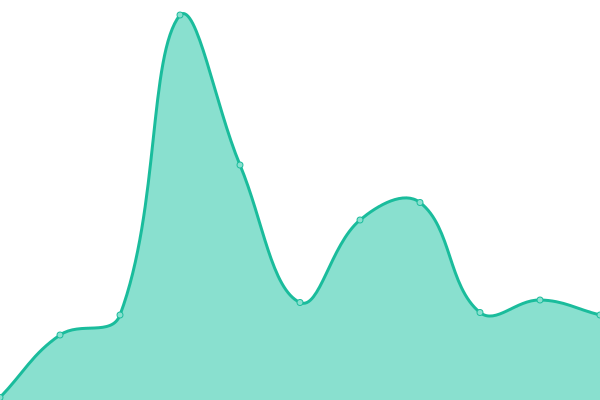

# [📈 Live Status](https://status.opentunnel.net): <!--live status--> **🟩 All systems operational**

This repository contains the open-source uptime monitor and status page for [roosterkid](https://status.opentunnel.net), powered by [Upptime](https://github.com/upptime/upptime).

With [Upptime](https://upptime.js.org), you can get your own unlimited and free uptime monitor and status page, powered entirely by a GitHub repository. We use [Issues](https://github.com/roosterkid/opentunnel-status-server/issues) as incident reports, [Actions](https://github.com/roosterkid/opentunnel-status-server/actions) as uptime monitors, and [Pages](https://status.opentunnel.net) for the status page.

<!--start: status pages-->
<!-- This summary is generated by Upptime (https://github.com/upptime/upptime) -->
<!-- Do not edit this manually, your changes will be overwritten -->
<!-- prettier-ignore -->
| URL | Status | History | Response Time | Uptime |
| --- | ------ | ------- | ------------- | ------ |
|  [OpenTunnel.net Website](https://opentunnel.net/) | 🟩 Up | [open-tunnel-net-website.yml](https://github.com/roosterkid/opentunnel-status-server/commits/HEAD/history/open-tunnel-net-website.yml) | 

 326ms
     
 | 

<a href="https://status.opentunnel.net/history/open-tunnel-net-website">100.00%</a>
    

|  [OpenTunnel.net Community](https://forum.opentunnel.net/) | 🟩 Up | [open-tunnel-net-community.yml](https://github.com/roosterkid/opentunnel-status-server/commits/HEAD/history/open-tunnel-net-community.yml) | 

 547ms
     
 | 

<a href="https://status.opentunnel.net/history/open-tunnel-net-community">100.00%</a>
    

|  [OpenTunnel.net VIP](https://vip.opentunnel.net/) | 🟩 Up | [open-tunnel-net-vip.yml](https://github.com/roosterkid/opentunnel-status-server/commits/HEAD/history/open-tunnel-net-vip.yml) | 

 264ms
     
 | 

<a href="https://status.opentunnel.net/history/open-tunnel-net-vip">100.00%</a>
    

|  [XRAY 🇸🇬 Singapore SGL 1](https://sgx-1.openv2ray.com/) | 🟩 Up | [xray-singapore-sgl-1.yml](https://github.com/roosterkid/opentunnel-status-server/commits/HEAD/history/xray-singapore-sgl-1.yml) | 

 715ms
     
 | 

<a href="https://status.opentunnel.net/history/xray-singapore-sgl-1">100.00%</a>
    

|  [XRAY 🇸🇬 Singapore SGO 1](https://sgx-2.openv2ray.com/) | 🟩 Up | [xray-singapore-sgo-1.yml](https://github.com/roosterkid/opentunnel-status-server/commits/HEAD/history/xray-singapore-sgo-1.yml) | 

 712ms
     
 | 

<a href="https://status.opentunnel.net/history/xray-singapore-sgo-1">100.00%</a>
    

|  [XRAY 🇺🇸 United States USO 1](https://usx-1.openv2ray.com/) | 🟩 Up | [xray-united-states-uso-1.yml](https://github.com/roosterkid/opentunnel-status-server/commits/HEAD/history/xray-united-states-uso-1.yml) | 

 373ms
     
 | 

<a href="https://status.opentunnel.net/history/xray-united-states-uso-1">100.00%</a>
    

|  [XRAY 🇿🇦 South Africa ZAP 1](https://zax-1.openv2ray.com/) | 🟩 Up | [xray-south-africa-zap-1.yml](https://github.com/roosterkid/opentunnel-status-server/commits/HEAD/history/xray-south-africa-zap-1.yml) | 

 776ms
     
 | 

<a href="https://status.opentunnel.net/history/xray-south-africa-zap-1">92.59%</a>
    

|  [XRAY 🇰🇷 South Korea KRP 1](https://krx-1.openv2ray.com/) | 🟩 Up | [xray-south-korea-krp-1.yml](https://github.com/roosterkid/opentunnel-status-server/commits/HEAD/history/xray-south-korea-krp-1.yml) | 

 584ms
     
 | 

<a href="https://status.opentunnel.net/history/xray-south-korea-krp-1">100.00%</a>
    

|  [XRAY 🇳🇱 Netherlands NLI 1](https://nlx-1.openv2ray.com/) | 🟩 Up | [xray-netherlands-nli-1.yml](https://github.com/roosterkid/opentunnel-status-server/commits/HEAD/history/xray-netherlands-nli-1.yml) | 

 315ms
     
 | 

<a href="https://status.opentunnel.net/history/xray-netherlands-nli-1">99.26%</a>
    

|  [XRAY 🇮🇩 Indonesia IDA 1](https://idx-1.openv2ray.com/) | 🟩 Up | [xray-indonesia-ida-1.yml](https://github.com/roosterkid/opentunnel-status-server/commits/HEAD/history/xray-indonesia-ida-1.yml) | 

 774ms
     
 | 

<a href="https://status.opentunnel.net/history/xray-indonesia-ida-1">99.26%</a>
    

|  [XRAY 🇯🇵 Japan JPP 1](https://jpx-1.openv2ray.com/) | 🟩 Up | [xray-japan-jpp-1.yml](https://github.com/roosterkid/opentunnel-status-server/commits/HEAD/history/xray-japan-jpp-1.yml) | 

 472ms
     
 | 

<a href="https://status.opentunnel.net/history/xray-japan-jpp-1">100.00%</a>
    

|  [XRAY 🇧🇷 Brazil BRP 1](https://brx-1.openv2ray.com/) | 🟩 Up | [xray-brazil-brp-1.yml](https://github.com/roosterkid/opentunnel-status-server/commits/HEAD/history/xray-brazil-brp-1.yml) | 

 475ms
     
 | 

<a href="https://status.opentunnel.net/history/xray-brazil-brp-1">100.00%</a>
    

|  [XRAY 🇷🇺 Russia RUL 1](https://rux-1.openv2ray.com/) | 🟩 Up | [xray-russia-rul-1.yml](https://github.com/roosterkid/opentunnel-status-server/commits/HEAD/history/xray-russia-rul-1.yml) | 

 566ms
     
 | 

<a href="https://status.opentunnel.net/history/xray-russia-rul-1">100.00%</a>
    

|  [XRAY 🇸🇬 Singapore SGD 1](https://sgx-3.openv2ray.com/) | 🟩 Up | [xray-singapore-sgd-1.yml](https://github.com/roosterkid/opentunnel-status-server/commits/HEAD/history/xray-singapore-sgd-1.yml) | 

 668ms
     
 | 

<a href="https://status.opentunnel.net/history/xray-singapore-sgd-1">100.00%</a>
    

|  [XRAY 🇮🇳 India IND 1](https://inx-1.openv2ray.com/) | 🟩 Up | [xray-india-ind-1.yml](https://github.com/roosterkid/opentunnel-status-server/commits/HEAD/history/xray-india-ind-1.yml) | 

 685ms
     
 | 

<a href="https://status.opentunnel.net/history/xray-india-ind-1">100.00%</a>
    

|  [XRAY 🇩🇪 Germany DEH 1](https://dex-1.openv2ray.com/) | 🟩 Up | [xray-germany-deh-1.yml](https://github.com/roosterkid/opentunnel-status-server/commits/HEAD/history/xray-germany-deh-1.yml) | 

 323ms
     
 | 

<a href="https://status.opentunnel.net/history/xray-germany-deh-1">100.00%</a>
    

|  [XRAY 🇨🇦 Canada CAO 1](https://cax-1.openv2ray.com/) | 🟩 Up | [xray-canada-cao-1.yml](https://github.com/roosterkid/opentunnel-status-server/commits/HEAD/history/xray-canada-cao-1.yml) | 

 106ms
     
 | 

<a href="https://status.opentunnel.net/history/xray-canada-cao-1">100.00%</a>
    

|  [V2RAY 🇸🇬 Singapore SGL 1](https://sgv-1.openv2ray.com/) | 🟩 Up | [v2-ray-singapore-sgl-1.yml](https://github.com/roosterkid/opentunnel-status-server/commits/HEAD/history/v2-ray-singapore-sgl-1.yml) | 

 673ms
     
 | 

<a href="https://status.opentunnel.net/history/v2-ray-singapore-sgl-1">100.00%</a>
    

|  [V2RAY 🇸🇬 Singapore SGP 1](https://sgv-2.openv2ray.com/) | 🟩 Up | [v2-ray-singapore-sgp-1.yml](https://github.com/roosterkid/opentunnel-status-server/commits/HEAD/history/v2-ray-singapore-sgp-1.yml) | 

 662ms
     
 | 

<a href="https://status.opentunnel.net/history/v2-ray-singapore-sgp-1">99.79%</a>
    

|  [V2RAY 🇮🇩 Indonesia IDA 1](https://idv-1.openv2ray.com/) | 🟩 Up | [v2-ray-indonesia-ida-1.yml](https://github.com/roosterkid/opentunnel-status-server/commits/HEAD/history/v2-ray-indonesia-ida-1.yml) | 

 690ms
     
 | 

<a href="https://status.opentunnel.net/history/v2-ray-indonesia-ida-1">99.43%</a>
    

|  [V2RAY 🇺🇸 United States USO 1](https://usv-1.openv2ray.com/) | 🟩 Up | [v2-ray-united-states-uso-1.yml](https://github.com/roosterkid/opentunnel-status-server/commits/HEAD/history/v2-ray-united-states-uso-1.yml) | 

 134ms
     
 | 

<a href="https://status.opentunnel.net/history/v2-ray-united-states-uso-1">100.00%</a>
    

|  [V2RAY 🇸🇬 Singapore SGD 1](https://sgv-3.openv2ray.com/) | 🟩 Up | [v2-ray-singapore-sgd-1.yml](https://github.com/roosterkid/opentunnel-status-server/commits/HEAD/history/v2-ray-singapore-sgd-1.yml) | 

 681ms
     
 | 

<a href="https://status.opentunnel.net/history/v2-ray-singapore-sgd-1">99.56%</a>
    

|  [V2RAY 🇸🇬 Singapore SGO 1](https://sgv-4.openv2ray.com/) | 🟩 Up | [v2-ray-singapore-sgo-1.yml](https://github.com/roosterkid/opentunnel-status-server/commits/HEAD/history/v2-ray-singapore-sgo-1.yml) | 

 703ms
     
 | 

<a href="https://status.opentunnel.net/history/v2-ray-singapore-sgo-1">100.00%</a>
    

|  [V2RAY 🇻🇳 Vietnam VN 1](https://vnv-1.openv2ray.com/) | 🟩 Up | [v2-ray-vietnam-vn-1.yml](https://github.com/roosterkid/opentunnel-status-server/commits/HEAD/history/v2-ray-vietnam-vn-1.yml) | 

 1111ms
     
 | 

<a href="https://status.opentunnel.net/history/v2-ray-vietnam-vn-1">97.98%</a>
    

|  [V2RAY 🇸🇬 Singapore SGV 1](https://sgv-5.openv2ray.com/) | 🟩 Up | [v2-ray-singapore-sgv-1.yml](https://github.com/roosterkid/opentunnel-status-server/commits/HEAD/history/v2-ray-singapore-sgv-1.yml) | 

 664ms
     
 | 

<a href="https://status.opentunnel.net/history/v2-ray-singapore-sgv-1">100.00%</a>
    

|  [V2RAY 🇷🇺 Russia RUL 1](https://ruv-1.openv2ray.com/) | 🟩 Up | [v2-ray-russia-rul-1.yml](https://github.com/roosterkid/opentunnel-status-server/commits/HEAD/history/v2-ray-russia-rul-1.yml) | 

 424ms
     
 | 

<a href="https://status.opentunnel.net/history/v2-ray-russia-rul-1">97.29%</a>
    

|  [V2RAY 🇦🇺 Australia AUL 1](https://auv-1.openv2ray.com/) | 🟩 Up | [v2-ray-australia-aul-1.yml](https://github.com/roosterkid/opentunnel-status-server/commits/HEAD/history/v2-ray-australia-aul-1.yml) | 

 608ms
     
 | 

<a href="https://status.opentunnel.net/history/v2-ray-australia-aul-1">100.00%</a>
    

|  [V2RAY 🇺🇸 United States USO 2](https://usv-2.openv2ray.com/) | 🟩 Up | [v2-ray-united-states-uso-2.yml](https://github.com/roosterkid/opentunnel-status-server/commits/HEAD/history/v2-ray-united-states-uso-2.yml) | 

 139ms
     
 | 

<a href="https://status.opentunnel.net/history/v2-ray-united-states-uso-2">100.00%</a>
    

|  [V2RAY 🇺🇸 United States USO 3](https://usv-3.openv2ray.com/) | 🟩 Up | [v2-ray-united-states-uso-3.yml](https://github.com/roosterkid/opentunnel-status-server/commits/HEAD/history/v2-ray-united-states-uso-3.yml) | 

 134ms
     
 | 

<a href="https://status.opentunnel.net/history/v2-ray-united-states-uso-3">99.77%</a>
    

|  [V2RAY 🇮🇩 Indonesia IDG 1](https://idv-2.openv2ray.com/) | 🟩 Up | [v2-ray-indonesia-idg-1.yml](https://github.com/roosterkid/opentunnel-status-server/commits/HEAD/history/v2-ray-indonesia-idg-1.yml) | 

 686ms
     
 | 

<a href="https://status.opentunnel.net/history/v2-ray-indonesia-idg-1">100.00%</a>
    

|  [V2RAY 🇸🇬 Singapore SGO 2](https://sgv-6.openv2ray.com/) | 🟩 Up | [v2-ray-singapore-sgo-2.yml](https://github.com/roosterkid/opentunnel-status-server/commits/HEAD/history/v2-ray-singapore-sgo-2.yml) | 

 678ms
     
 | 

<a href="https://status.opentunnel.net/history/v2-ray-singapore-sgo-2">100.00%</a>
    

|  [V2RAY 🇳🇱 Netherlands NLB 6](https://nlv-6.openv2ray.com/) | 🟩 Up | [v2-ray-netherlands-nlb-6.yml](https://github.com/roosterkid/opentunnel-status-server/commits/HEAD/history/v2-ray-netherlands-nlb-6.yml) | 

 311ms
     
 | 

<a href="https://status.opentunnel.net/history/v2-ray-netherlands-nlb-6">100.00%</a>
    

|  [V2RAY 🇳🇱 Netherlands NLB 1](https://nlv-1.openv2ray.com/) | 🟩 Up | [v2-ray-netherlands-nlb-1.yml](https://github.com/roosterkid/opentunnel-status-server/commits/HEAD/history/v2-ray-netherlands-nlb-1.yml) | 

 496ms
     
 | 

<a href="https://status.opentunnel.net/history/v2-ray-netherlands-nlb-1">100.00%</a>
    

|  [V2RAY 🇩🇪 Germany DEH 1](https://dev-1.openv2ray.com/) | 🟩 Up | [v2-ray-germany-deh-1.yml](https://github.com/roosterkid/opentunnel-status-server/commits/HEAD/history/v2-ray-germany-deh-1.yml) | 

 324ms
     
 | 

<a href="https://status.opentunnel.net/history/v2-ray-germany-deh-1">100.00%</a>
    

|  [V2RAY 🇩🇪 Germany DEH 2](https://dev-2.openv2ray.com/) | 🟩 Up | [v2-ray-germany-deh-2.yml](https://github.com/roosterkid/opentunnel-status-server/commits/HEAD/history/v2-ray-germany-deh-2.yml) | 

 330ms
     
 | 

<a href="https://status.opentunnel.net/history/v2-ray-germany-deh-2">100.00%</a>
    

|  [V2RAY 🇭🇰 Hong Kong HKM 1](https://hkv-1.openv2ray.com/) | 🟩 Up | [v2-ray-hong-kong-hkm-1.yml](https://github.com/roosterkid/opentunnel-status-server/commits/HEAD/history/v2-ray-hong-kong-hkm-1.yml) | 

 661ms
     
 | 

<a href="https://status.opentunnel.net/history/v2-ray-hong-kong-hkm-1">100.00%</a>
    

|  [V2RAY 🇺🇸 United States USP 4](https://usv-4.openv2ray.com/) | 🟩 Up | [v2-ray-united-states-usp-4.yml](https://github.com/roosterkid/opentunnel-status-server/commits/HEAD/history/v2-ray-united-states-usp-4.yml) | 

 177ms
     
 | 

<a href="https://status.opentunnel.net/history/v2-ray-united-states-usp-4">99.52%</a>
    

|  [V2RAY 🇮🇩 Indonesia IDA 2](https://idv-3.openv2ray.com/) | 🟩 Up | [v2-ray-indonesia-ida-2.yml](https://github.com/roosterkid/opentunnel-status-server/commits/HEAD/history/v2-ray-indonesia-ida-2.yml) | 

 717ms
     
 | 

<a href="https://status.opentunnel.net/history/v2-ray-indonesia-ida-2">98.04%</a>
    

|  [TROJAN 🇸🇬 Singapore SGV 1](https://sgt-1.opensvr.net/) | 🟩 Up | [trojan-singapore-sgv-1.yml](https://github.com/roosterkid/opentunnel-status-server/commits/HEAD/history/trojan-singapore-sgv-1.yml) | 

 784ms
     
 | 

<a href="https://status.opentunnel.net/history/trojan-singapore-sgv-1">99.25%</a>
    

|  [TROJAN 🇸🇬 Singapore SGP 1](https://sgt-2.opensvr.net/) | 🟩 Up | [trojan-singapore-sgp-1.yml](https://github.com/roosterkid/opentunnel-status-server/commits/HEAD/history/trojan-singapore-sgp-1.yml) | 

 1090ms
     
 | 

<a href="https://status.opentunnel.net/history/trojan-singapore-sgp-1">97.47%</a>
    

|  [TROJAN 🇩🇪 Germany DEH 1](https://det-1.opensvr.net/) | 🟩 Up | [trojan-germany-deh-1.yml](https://github.com/roosterkid/opentunnel-status-server/commits/HEAD/history/trojan-germany-deh-1.yml) | 

 356ms
     
 | 

<a href="https://status.opentunnel.net/history/trojan-germany-deh-1">100.00%</a>
    

|  [TROJAN 🇳🇱 Netherlands NLB 1](https://nlt-1.opensvr.net/) | 🟩 Up | [trojan-netherlands-nlb-1.yml](https://github.com/roosterkid/opentunnel-status-server/commits/HEAD/history/trojan-netherlands-nlb-1.yml) | 

 321ms
     
 | 

<a href="https://status.opentunnel.net/history/trojan-netherlands-nlb-1">100.00%</a>
    

|  [TROJAN 🇯🇵 Japan JPP 1](https://jpt-1.opensvr.net/) | 🟩 Up | [trojan-japan-jpp-1.yml](https://github.com/roosterkid/opentunnel-status-server/commits/HEAD/history/trojan-japan-jpp-1.yml) | 

 557ms
     
 | 

<a href="https://status.opentunnel.net/history/trojan-japan-jpp-1">96.71%</a>
    

|  [TROJAN 🇺🇸 United States USO 1](https://ust-1.opensvr.net/) | 🟩 Up | [trojan-united-states-uso-1.yml](https://github.com/roosterkid/opentunnel-status-server/commits/HEAD/history/trojan-united-states-uso-1.yml) | 

 364ms
     
 | 

<a href="https://status.opentunnel.net/history/trojan-united-states-uso-1">99.57%</a>
    

|  [TROJAN 🇸🇬 Singapore SGA 1](https://sgt-3.opensvr.net/) | 🟩 Up | [trojan-singapore-sga-1.yml](https://github.com/roosterkid/opentunnel-status-server/commits/HEAD/history/trojan-singapore-sga-1.yml) | 

 1225ms
     
 | 

<a href="https://status.opentunnel.net/history/trojan-singapore-sga-1">98.99%</a>
    

|  [TROJAN 🇮🇩 Indonesia IDJ 1](https://idt-1.opensvr.net/) | 🟩 Up | [trojan-indonesia-idj-1.yml](https://github.com/roosterkid/opentunnel-status-server/commits/HEAD/history/trojan-indonesia-idj-1.yml) | 

 1167ms
     
 | 

<a href="https://status.opentunnel.net/history/trojan-indonesia-idj-1">54.85%</a>
    

|  [SSH 🇸🇬 Singapore SGP 1](http://sgs-4.opensvr.net:8080/) | 🟩 Up | [ssh-singapore-sgp-1.yml](https://github.com/roosterkid/opentunnel-status-server/commits/HEAD/history/ssh-singapore-sgp-1.yml) | 

 445ms
     
 | 

<a href="https://status.opentunnel.net/history/ssh-singapore-sgp-1">100.00%</a>
    

|  [SSH 🇺🇸 United States USF 1](http://uss-1.opensvr.net:8080/) | 🟩 Up | [ssh-united-states-usf-1.yml](https://github.com/roosterkid/opentunnel-status-server/commits/HEAD/history/ssh-united-states-usf-1.yml) | 

 183ms
     
 | 

<a href="https://status.opentunnel.net/history/ssh-united-states-usf-1">99.55%</a>
    

|  [SSH 🇸🇬 Singapore SGD 2](http://sgs-1.opensvr.net:8080/) | 🟩 Up | [ssh-singapore-sgd-2.yml](https://github.com/roosterkid/opentunnel-status-server/commits/HEAD/history/ssh-singapore-sgd-2.yml) | 

 447ms
     
 | 

<a href="https://status.opentunnel.net/history/ssh-singapore-sgd-2">100.00%</a>
    

|  [SSH 🇩🇪 Germany DEH 1](http://des-1.opensvr.net:8080/) | 🟩 Up | [ssh-germany-deh-1.yml](https://github.com/roosterkid/opentunnel-status-server/commits/HEAD/history/ssh-germany-deh-1.yml) | 

 223ms
     
 | 

<a href="https://status.opentunnel.net/history/ssh-germany-deh-1">99.84%</a>
    

|  [SSH 🇸🇬 Singapore SGP 2](http://sgs-2.opensvr.net:8080/) | 🟩 Up | [ssh-singapore-sgp-2.yml](https://github.com/roosterkid/opentunnel-status-server/commits/HEAD/history/ssh-singapore-sgp-2.yml) | 

 433ms
     
 | 

<a href="https://status.opentunnel.net/history/ssh-singapore-sgp-2">99.58%</a>
    

|  [SSH 🇮🇩 Indonesia IDJ 1](http://ids-1.opensvr.net:8080/) | 🟩 Up | [ssh-indonesia-idj-1.yml](https://github.com/roosterkid/opentunnel-status-server/commits/HEAD/history/ssh-indonesia-idj-1.yml) | 

 473ms
     
 | 

<a href="https://status.opentunnel.net/history/ssh-indonesia-idj-1">100.00%</a>
    

|  [SSH 🇸🇬 Singapore SGL 1](http://sgs-3.opensvr.net:8080/) | 🟩 Up | [ssh-singapore-sgl-1.yml](https://github.com/roosterkid/opentunnel-status-server/commits/HEAD/history/ssh-singapore-sgl-1.yml) | 

 452ms
     
 | 

<a href="https://status.opentunnel.net/history/ssh-singapore-sgl-1">100.00%</a>
    

|  [SSH 🇫🇷 France FRO 1](http://frs-1.opensvr.net:8080/) | 🟩 Up | [ssh-france-fro-1.yml](https://github.com/roosterkid/opentunnel-status-server/commits/HEAD/history/ssh-france-fro-1.yml) | 

 221ms
     
 | 

<a href="https://status.opentunnel.net/history/ssh-france-fro-1">99.38%</a>
    

|  [SSH 🇨🇦 Canada CAO 1](http://cas-1.opensvr.net:8080/) | 🟩 Up | [ssh-canada-cao-1.yml](https://github.com/roosterkid/opentunnel-status-server/commits/HEAD/history/ssh-canada-cao-1.yml) | 

 85ms
     
 | 

<a href="https://status.opentunnel.net/history/ssh-canada-cao-1">99.79%</a>
    

|  [SSH 🇸🇬 Singapore SGD 1](http://sgs-5.opensvr.net:8080/) | 🟩 Up | [ssh-singapore-sgd-1.yml](https://github.com/roosterkid/opentunnel-status-server/commits/HEAD/history/ssh-singapore-sgd-1.yml) | 

 448ms
     
 | 

<a href="https://status.opentunnel.net/history/ssh-singapore-sgd-1">100.00%</a>
    

|  [SSH 🇮🇩 Indonesia IDA 1](http://ids-2.opensvr.net:8080/) | 🟩 Up | [ssh-indonesia-ida-1.yml](https://github.com/roosterkid/opentunnel-status-server/commits/HEAD/history/ssh-indonesia-ida-1.yml) | 

 463ms
     
 | 

<a href="https://status.opentunnel.net/history/ssh-indonesia-ida-1">99.12%</a>
    

|  [SSH 🇮🇳 India IND 1](http://ins-1.opensvr.net:8080/) | 🟩 Up | [ssh-india-ind-1.yml](https://github.com/roosterkid/opentunnel-status-server/commits/HEAD/history/ssh-india-ind-1.yml) | 

 457ms
     
 | 

<a href="https://status.opentunnel.net/history/ssh-india-ind-1">100.00%</a>
    

|  [SSH 🇺🇸 United States USF 2](http://uss-2.opensvr.net:8080/) | 🟩 Up | [ssh-united-states-usf-2.yml](https://github.com/roosterkid/opentunnel-status-server/commits/HEAD/history/ssh-united-states-usf-2.yml) | 

 59ms
     
 | 

<a href="https://status.opentunnel.net/history/ssh-united-states-usf-2">99.54%</a>
    

|  [SSH 🇩🇪 Germany DEH 2](http://des-2.opensvr.net:8080/) | 🟩 Up | [ssh-germany-deh-2.yml](https://github.com/roosterkid/opentunnel-status-server/commits/HEAD/history/ssh-germany-deh-2.yml) | 

 219ms
     
 | 

<a href="https://status.opentunnel.net/history/ssh-germany-deh-2">100.00%</a>
    

|  [SSH 🇫🇷 France FRO 2](http://frs-2.opensvr.net:8080/) | 🟩 Up | [ssh-france-fro-2.yml](https://github.com/roosterkid/opentunnel-status-server/commits/HEAD/history/ssh-france-fro-2.yml) | 

 232ms
     
 | 

<a href="https://status.opentunnel.net/history/ssh-france-fro-2">99.76%</a>
    

|  [SSH 🇮🇩 Indonesia IDB 1](http://ids-3.opensvr.net:8080/) | 🟩 Up | [ssh-indonesia-idb-1.yml](https://github.com/roosterkid/opentunnel-status-server/commits/HEAD/history/ssh-indonesia-idb-1.yml) | 

 1013ms
     
 | 

<a href="https://status.opentunnel.net/history/ssh-indonesia-idb-1">99.82%</a>
    

|  [SSH 🇧🇬 Bulgaria BGI 1](http://bgs-1.opensvr.net:8080/) | 🟩 Up | [ssh-bulgaria-bgi-1.yml](https://github.com/roosterkid/opentunnel-status-server/commits/HEAD/history/ssh-bulgaria-bgi-1.yml) | 

 266ms
     
 | 

<a href="https://status.opentunnel.net/history/ssh-bulgaria-bgi-1">99.85%</a>
    

|  [SSH 🇺🇦 Ukraine UAI 1](http://uas-1.opensvr.net:8080/) | 🟩 Up | [ssh-ukraine-uai-1.yml](https://github.com/roosterkid/opentunnel-status-server/commits/HEAD/history/ssh-ukraine-uai-1.yml) | 

 288ms
     
 | 

<a href="https://status.opentunnel.net/history/ssh-ukraine-uai-1">99.84%</a>
    

|  [SSH 🇮🇩 Indonesia IDB 2](http://ids-4.opensvr.net:8080/) | 🟩 Up | [ssh-indonesia-idb-2.yml](https://github.com/roosterkid/opentunnel-status-server/commits/HEAD/history/ssh-indonesia-idb-2.yml) | 

 554ms
     
 | 

<a href="https://status.opentunnel.net/history/ssh-indonesia-idb-2">99.80%</a>
    

|  [SSH 🇺🇸 United States USD 1](http://uss-3.opensvr.net:8080/) | 🟩 Up | [ssh-united-states-usd-1.yml](https://github.com/roosterkid/opentunnel-status-server/commits/HEAD/history/ssh-united-states-usd-1.yml) | 

 52ms
     
 | 

<a href="https://status.opentunnel.net/history/ssh-united-states-usd-1">100.00%</a>
    

|  [PPTP 🇸🇬 Singapore SGD 1](http://sgp-1.opensvr.net/) | 🟩 Up | [pptp-singapore-sgd-1.yml](https://github.com/roosterkid/opentunnel-status-server/commits/HEAD/history/pptp-singapore-sgd-1.yml) | 

 442ms
     
 | 

<a href="https://status.opentunnel.net/history/pptp-singapore-sgd-1">100.00%</a>
    

|  [PPTP 🇺🇸 United States USF 1](http://usp-1.opensvr.net/) | 🟩 Up | [pptp-united-states-usf-1.yml](https://github.com/roosterkid/opentunnel-status-server/commits/HEAD/history/pptp-united-states-usf-1.yml) | 

 163ms
     
 | 

<a href="https://status.opentunnel.net/history/pptp-united-states-usf-1">100.00%</a>
    

|  [PPTP 🇫🇷 France FRT 1](http://frp-1.opensvr.net/) | 🟩 Up | [pptp-france-frt-1.yml](https://github.com/roosterkid/opentunnel-status-server/commits/HEAD/history/pptp-france-frt-1.yml) | 

 208ms
     
 | 

<a href="https://status.opentunnel.net/history/pptp-france-frt-1">100.00%</a>
    

|  [PPTP 🇮🇩 Indonesia IDJ 1](http://idp-2.opensvr.net/) | 🟩 Up | [pptp-indonesia-idj-1.yml](https://github.com/roosterkid/opentunnel-status-server/commits/HEAD/history/pptp-indonesia-idj-1.yml) | 

 466ms
     
 | 

<a href="https://status.opentunnel.net/history/pptp-indonesia-idj-1">98.91%</a>
    

|  [PPTP 🇻🇳 Vietnam VNV 1](http://vnp-1.opensvr.net/) | 🟩 Up | [pptp-vietnam-vnv-1.yml](https://github.com/roosterkid/opentunnel-status-server/commits/HEAD/history/pptp-vietnam-vnv-1.yml) | 

 451ms
     
 | 

<a href="https://status.opentunnel.net/history/pptp-vietnam-vnv-1">99.79%</a>
    

|  [OVPN 🇸🇬 Singapore SGP 1](http://sgo-1.opensvr.net:8080/) | 🟩 Up | [ovpn-singapore-sgp-1.yml](https://github.com/roosterkid/opentunnel-status-server/commits/HEAD/history/ovpn-singapore-sgp-1.yml) | 

 422ms
     
 | 

<a href="https://status.opentunnel.net/history/ovpn-singapore-sgp-1">92.76%</a>
    

|  [OVPN 🇺🇸 United States USF 1](http://uso-1.opensvr.net:8080/) | 🟩 Up | [ovpn-united-states-usf-1.yml](https://github.com/roosterkid/opentunnel-status-server/commits/HEAD/history/ovpn-united-states-usf-1.yml) | 

 146ms
     
 | 

<a href="https://status.opentunnel.net/history/ovpn-united-states-usf-1">100.00%</a>
    

|  [OVPN 🇸🇬 Singapore SGD 1](http://sgo-2.opensvr.net:8080/) | 🟩 Up | [ovpn-singapore-sgd-1.yml](https://github.com/roosterkid/opentunnel-status-server/commits/HEAD/history/ovpn-singapore-sgd-1.yml) | 

 443ms
     
 | 

<a href="https://status.opentunnel.net/history/ovpn-singapore-sgd-1">100.00%</a>
    

|  [OVPN 🇩🇪 Germany DEH 1](http://deo-1.opensvr.net:8080/) | 🟩 Up | [ovpn-germany-deh-1.yml](https://github.com/roosterkid/opentunnel-status-server/commits/HEAD/history/ovpn-germany-deh-1.yml) | 

 213ms
     
 | 

<a href="https://status.opentunnel.net/history/ovpn-germany-deh-1">100.00%</a>
    

|  [OVPN 🇫🇷 France FRO 1](http://fro-1.opensvr.net:8080/) | 🟩 Up | [ovpn-france-fro-1.yml](https://github.com/roosterkid/opentunnel-status-server/commits/HEAD/history/ovpn-france-fro-1.yml) | 

 209ms
     
 | 

<a href="https://status.opentunnel.net/history/ovpn-france-fro-1">100.00%</a>
    

|  [OVPN 🇺🇸 United States USQ 1](http://uso-2.opensvr.net:8080/) | 🟩 Up | [ovpn-united-states-usq-1.yml](https://github.com/roosterkid/opentunnel-status-server/commits/HEAD/history/ovpn-united-states-usq-1.yml) | 

 202ms
     
 | 

<a href="https://status.opentunnel.net/history/ovpn-united-states-usq-1">99.83%</a>
    

|  [OVPN 🇸🇬 Singapore SGD 2](http://sgo-3.opensvr.net:8080/) | 🟩 Up | [ovpn-singapore-sgd-2.yml](https://github.com/roosterkid/opentunnel-status-server/commits/HEAD/history/ovpn-singapore-sgd-2.yml) | 

 440ms
     
 | 

<a href="https://status.opentunnel.net/history/ovpn-singapore-sgd-2">100.00%</a>
    

|  [OVPN 🇮🇩 Indonesia IDJ 1](http://ido-1.opensvr.net:8080/) | 🟩 Up | [ovpn-indonesia-idj-1.yml](https://github.com/roosterkid/opentunnel-status-server/commits/HEAD/history/ovpn-indonesia-idj-1.yml) | 

 473ms
     
 | 

<a href="https://status.opentunnel.net/history/ovpn-indonesia-idj-1">100.00%</a>
    

|  [OVPN 🇹🇷 Turkey TRC 1](http://tro-1.opensvr.net:8080/) | 🟩 Up | [ovpn-turkey-trc-1.yml](https://github.com/roosterkid/opentunnel-status-server/commits/HEAD/history/ovpn-turkey-trc-1.yml) | 

 286ms
     
 | 

<a href="https://status.opentunnel.net/history/ovpn-turkey-trc-1">100.00%</a>
    

<!--end: status pages-->

[**Visit our status website →**](https://status.opentunnel.net)

## 📄 License

- Powered by: [Upptime](https://github.com/upptime/upptime)
- Code: [MIT](./LICENSE) © [roosterkid](https://status.opentunnel.net)
- Data in the `./history` directory: [Open Database License](https://opendatacommons.org/licenses/odbl/1-0/)
