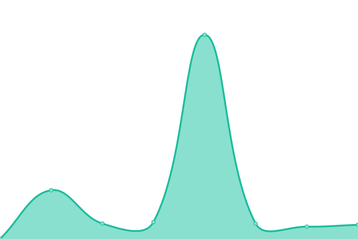
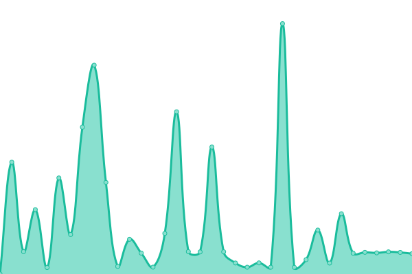
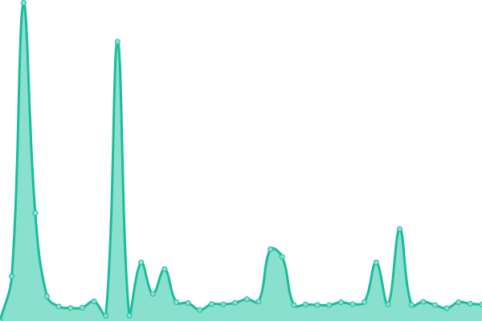

# [📈 Live Status](https://status.opentunnel.net): <!--live status--> **🟧 Partial outage**

This repository contains the open-source uptime monitor and status page for [roosterkid](https://status.opentunnel.net), powered by [Upptime](https://github.com/upptime/upptime).

With [Upptime](https://upptime.js.org), you can get your own unlimited and free uptime monitor and status page, powered entirely by a GitHub repository. We use [Issues](https://github.com/roosterkid/opentunnel-status-server/issues) as incident reports, [Actions](https://github.com/roosterkid/opentunnel-status-server/actions) as uptime monitors, and [Pages](https://status.opentunnel.net) for the status page.

<!--start: status pages-->
<!-- This summary is generated by Upptime (https://github.com/upptime/upptime) -->
<!-- Do not edit this manually, your changes will be overwritten -->
<!-- prettier-ignore -->
| URL | Status | History | Response Time | Uptime |
| --- | ------ | ------- | ------------- | ------ |
|  [OpenTunnel.net Website](https://opentunnel.net/) | 🟩 Up | [open-tunnel-net-website.yml](https://github.com/roosterkid/opentunnel-status-server/commits/HEAD/history/open-tunnel-net-website.yml) | 

 365ms
     
 | 

<a href="https://status.opentunnel.net/history/open-tunnel-net-website">100.00%</a>
    

|  [OpenTunnel.net Community](https://forum.opentunnel.net/) | 🟩 Up | [open-tunnel-net-community.yml](https://github.com/roosterkid/opentunnel-status-server/commits/HEAD/history/open-tunnel-net-community.yml) | 

 514ms
     
 | 

<a href="https://status.opentunnel.net/history/open-tunnel-net-community">100.00%</a>
    

|  [OpenTunnel.net VIP](https://vip.opentunnel.net/) | 🟩 Up | [open-tunnel-net-vip.yml](https://github.com/roosterkid/opentunnel-status-server/commits/HEAD/history/open-tunnel-net-vip.yml) | 

 321ms
     
 | 

<a href="https://status.opentunnel.net/history/open-tunnel-net-vip">100.00%</a>
    

|  [XRAY 🇸🇬 Singapore SGL 1](https://sgx-1.openv2ray.com/) | 🟩 Up | [xray-singapore-sgl-1.yml](https://github.com/roosterkid/opentunnel-status-server/commits/HEAD/history/xray-singapore-sgl-1.yml) | 

 728ms
     
 | 

<a href="https://status.opentunnel.net/history/xray-singapore-sgl-1">100.00%</a>
    

|  [XRAY 🇸🇬 Singapore SGO 1](https://sgx-2.openv2ray.com/) | 🟩 Up | [xray-singapore-sgo-1.yml](https://github.com/roosterkid/opentunnel-status-server/commits/HEAD/history/xray-singapore-sgo-1.yml) | 

 688ms
     
 | 

<a href="https://status.opentunnel.net/history/xray-singapore-sgo-1">100.00%</a>
    

|  [XRAY 🇺🇸 United States USO 1](https://usx-1.openv2ray.com/) | 🟩 Up | [xray-united-states-uso-1.yml](https://github.com/roosterkid/opentunnel-status-server/commits/HEAD/history/xray-united-states-uso-1.yml) | 

 224ms
     
 | 

<a href="https://status.opentunnel.net/history/xray-united-states-uso-1">100.00%</a>
    

|  [XRAY 🇿🇦 South Africa ZAP 1](https://zax-1.openv2ray.com/) | 🟩 Up | [xray-south-africa-zap-1.yml](https://github.com/roosterkid/opentunnel-status-server/commits/HEAD/history/xray-south-africa-zap-1.yml) | 

 811ms
     
 | 

<a href="https://status.opentunnel.net/history/xray-south-africa-zap-1">100.00%</a>
    

|  [XRAY 🇰🇷 South Korea KRP 1](https://krx-1.openv2ray.com/) | 🟩 Up | [xray-south-korea-krp-1.yml](https://github.com/roosterkid/opentunnel-status-server/commits/HEAD/history/xray-south-korea-krp-1.yml) | 

 571ms
     
 | 

<a href="https://status.opentunnel.net/history/xray-south-korea-krp-1">100.00%</a>
    

|  [XRAY 🇳🇱 Netherlands NLI 1](https://nlx-1.openv2ray.com/) | 🟩 Up | [xray-netherlands-nli-1.yml](https://github.com/roosterkid/opentunnel-status-server/commits/HEAD/history/xray-netherlands-nli-1.yml) | 

 328ms
     
 | 

<a href="https://status.opentunnel.net/history/xray-netherlands-nli-1">100.00%</a>
    

|  [XRAY 🇮🇩 Indonesia IDA 1](https://idx-1.openv2ray.com/) | 🟩 Up | [xray-indonesia-ida-1.yml](https://github.com/roosterkid/opentunnel-status-server/commits/HEAD/history/xray-indonesia-ida-1.yml) | 

 685ms
     
 | 

<a href="https://status.opentunnel.net/history/xray-indonesia-ida-1">100.00%</a>
    

|  [XRAY 🇯🇵 Japan JPP 1](https://jpx-1.openv2ray.com/) | 🟩 Up | [xray-japan-jpp-1.yml](https://github.com/roosterkid/opentunnel-status-server/commits/HEAD/history/xray-japan-jpp-1.yml) | 

 431ms
     
 | 

<a href="https://status.opentunnel.net/history/xray-japan-jpp-1">95.83%</a>
    

|  [XRAY 🇧🇷 Brazil BRP 1](https://brx-1.openv2ray.com/) | 🟩 Up | [xray-brazil-brp-1.yml](https://github.com/roosterkid/opentunnel-status-server/commits/HEAD/history/xray-brazil-brp-1.yml) | 

 413ms
     
 | 

<a href="https://status.opentunnel.net/history/xray-brazil-brp-1">96.23%</a>
    

|  [XRAY 🇷🇺 Russia RUL 1](https://rux-1.openv2ray.com/) | 🟩 Up | [xray-russia-rul-1.yml](https://github.com/roosterkid/opentunnel-status-server/commits/HEAD/history/xray-russia-rul-1.yml) | 

 567ms
     
 | 

<a href="https://status.opentunnel.net/history/xray-russia-rul-1">100.00%</a>
    

|  [XRAY 🇸🇬 Singapore SGD 1](https://sgx-3.openv2ray.com/) | 🟩 Up | [xray-singapore-sgd-1.yml](https://github.com/roosterkid/opentunnel-status-server/commits/HEAD/history/xray-singapore-sgd-1.yml) | 

 680ms
     
 | 

<a href="https://status.opentunnel.net/history/xray-singapore-sgd-1">100.00%</a>
    

|  [XRAY 🇮🇳 India IND 1](https://inx-1.openv2ray.com/) | 🟩 Up | [xray-india-ind-1.yml](https://github.com/roosterkid/opentunnel-status-server/commits/HEAD/history/xray-india-ind-1.yml) | 

 681ms
     
 | 

<a href="https://status.opentunnel.net/history/xray-india-ind-1">100.00%</a>
    

|  [XRAY 🇩🇪 Germany DEH 1](https://dex-1.openv2ray.com/) | 🟩 Up | [xray-germany-deh-1.yml](https://github.com/roosterkid/opentunnel-status-server/commits/HEAD/history/xray-germany-deh-1.yml) | 

 362ms
     
 | 

<a href="https://status.opentunnel.net/history/xray-germany-deh-1">100.00%</a>
    

|  [XRAY 🇨🇦 Canada CAO 1](https://cax-1.openv2ray.com/) | 🟩 Up | [xray-canada-cao-1.yml](https://github.com/roosterkid/opentunnel-status-server/commits/HEAD/history/xray-canada-cao-1.yml) | 

 128ms
     
 | 

<a href="https://status.opentunnel.net/history/xray-canada-cao-1">100.00%</a>
    

|  [V2RAY 🇸🇬 Singapore SGL 1](https://sgv-1.openv2ray.com/) | 🟩 Up | [v2-ray-singapore-sgl-1.yml](https://github.com/roosterkid/opentunnel-status-server/commits/HEAD/history/v2-ray-singapore-sgl-1.yml) | 

 643ms
     
 | 

<a href="https://status.opentunnel.net/history/v2-ray-singapore-sgl-1">100.00%</a>
    

|  [V2RAY 🇸🇬 Singapore SGP 1](https://sgv-2.openv2ray.com/) | 🟩 Up | [v2-ray-singapore-sgp-1.yml](https://github.com/roosterkid/opentunnel-status-server/commits/HEAD/history/v2-ray-singapore-sgp-1.yml) | 

 690ms
     
 | 

<a href="https://status.opentunnel.net/history/v2-ray-singapore-sgp-1">93.62%</a>
    

|  [V2RAY 🇮🇩 Indonesia IDA 1](https://idv-1.openv2ray.com/) | 🟩 Up | [v2-ray-indonesia-ida-1.yml](https://github.com/roosterkid/opentunnel-status-server/commits/HEAD/history/v2-ray-indonesia-ida-1.yml) | 

 882ms
     
 | 

<a href="https://status.opentunnel.net/history/v2-ray-indonesia-ida-1">100.00%</a>
    

|  [V2RAY 🇺🇸 United States USO 1](https://usv-1.openv2ray.com/) | 🟩 Up | [v2-ray-united-states-uso-1.yml](https://github.com/roosterkid/opentunnel-status-server/commits/HEAD/history/v2-ray-united-states-uso-1.yml) | 

 144ms
     
 | 

<a href="https://status.opentunnel.net/history/v2-ray-united-states-uso-1">100.00%</a>
    

|  [V2RAY 🇸🇬 Singapore SGD 1](https://sgv-3.openv2ray.com/) | 🟩 Up | [v2-ray-singapore-sgd-1.yml](https://github.com/roosterkid/opentunnel-status-server/commits/HEAD/history/v2-ray-singapore-sgd-1.yml) | 

 600ms
     
 | 

<a href="https://status.opentunnel.net/history/v2-ray-singapore-sgd-1">100.00%</a>
    

|  [V2RAY 🇸🇬 Singapore SGO 1](https://sgv-4.openv2ray.com/) | 🟩 Up | [v2-ray-singapore-sgo-1.yml](https://github.com/roosterkid/opentunnel-status-server/commits/HEAD/history/v2-ray-singapore-sgo-1.yml) | 

 664ms
     
 | 

<a href="https://status.opentunnel.net/history/v2-ray-singapore-sgo-1">100.00%</a>
    

|  [V2RAY 🇻🇳 Vietnam VN 1](https://vnv-1.openv2ray.com/) | 🟩 Up | [v2-ray-vietnam-vn-1.yml](https://github.com/roosterkid/opentunnel-status-server/commits/HEAD/history/v2-ray-vietnam-vn-1.yml) | 

 1620ms
     
 | 

<a href="https://status.opentunnel.net/history/v2-ray-vietnam-vn-1">99.17%</a>
    

|  [V2RAY 🇸🇬 Singapore SGV 1](https://sgv-5.openv2ray.com/) | 🟩 Up | [v2-ray-singapore-sgv-1.yml](https://github.com/roosterkid/opentunnel-status-server/commits/HEAD/history/v2-ray-singapore-sgv-1.yml) | 

 639ms
     
 | 

<a href="https://status.opentunnel.net/history/v2-ray-singapore-sgv-1">100.00%</a>
    

|  [V2RAY 🇷🇺 Russia RUL 1](https://ruv-1.openv2ray.com/) | 🟩 Up | [v2-ray-russia-rul-1.yml](https://github.com/roosterkid/opentunnel-status-server/commits/HEAD/history/v2-ray-russia-rul-1.yml) | 

 482ms
     
 | 

<a href="https://status.opentunnel.net/history/v2-ray-russia-rul-1">99.69%</a>
    

|  [V2RAY 🇦🇺 Australia AUL 1](https://auv-1.openv2ray.com/) | 🟩 Up | [v2-ray-australia-aul-1.yml](https://github.com/roosterkid/opentunnel-status-server/commits/HEAD/history/v2-ray-australia-aul-1.yml) | 

 592ms
     
 | 

<a href="https://status.opentunnel.net/history/v2-ray-australia-aul-1">100.00%</a>
    

|  [V2RAY 🇺🇸 United States USO 2](https://usv-2.openv2ray.com/) | 🟩 Up | [v2-ray-united-states-uso-2.yml](https://github.com/roosterkid/opentunnel-status-server/commits/HEAD/history/v2-ray-united-states-uso-2.yml) | 

 143ms
     
 | 

<a href="https://status.opentunnel.net/history/v2-ray-united-states-uso-2">100.00%</a>
    

|  [V2RAY 🇺🇸 United States USO 3](https://usv-3.openv2ray.com/) | 🟩 Up | [v2-ray-united-states-uso-3.yml](https://github.com/roosterkid/opentunnel-status-server/commits/HEAD/history/v2-ray-united-states-uso-3.yml) | 

 143ms
     
 | 

<a href="https://status.opentunnel.net/history/v2-ray-united-states-uso-3">100.00%</a>
    

|  [V2RAY 🇮🇩 Indonesia IDG 1](https://idv-2.openv2ray.com/) | 🟩 Up | [v2-ray-indonesia-idg-1.yml](https://github.com/roosterkid/opentunnel-status-server/commits/HEAD/history/v2-ray-indonesia-idg-1.yml) | 

 1334ms
     
 | 

<a href="https://status.opentunnel.net/history/v2-ray-indonesia-idg-1">100.00%</a>
    

|  [V2RAY 🇸🇬 Singapore SGO 2](https://sgv-6.openv2ray.com/) | 🟩 Up | [v2-ray-singapore-sgo-2.yml](https://github.com/roosterkid/opentunnel-status-server/commits/HEAD/history/v2-ray-singapore-sgo-2.yml) | 

 663ms
     
 | 

<a href="https://status.opentunnel.net/history/v2-ray-singapore-sgo-2">100.00%</a>
    

|  [V2RAY 🇿🇦 South Africa ZAP 1](https://zav-1.openv2ray.com/) | 🟩 Up | [v2-ray-south-africa-zap-1.yml](https://github.com/roosterkid/opentunnel-status-server/commits/HEAD/history/v2-ray-south-africa-zap-1.yml) | 

 804ms
     
 | 

<a href="https://status.opentunnel.net/history/v2-ray-south-africa-zap-1">95.56%</a>
    

|  [V2RAY 🇳🇱 Netherlands NLB 6](https://nlv-6.openv2ray.com/) | 🟩 Up | [v2-ray-netherlands-nlb-6.yml](https://github.com/roosterkid/opentunnel-status-server/commits/HEAD/history/v2-ray-netherlands-nlb-6.yml) | 

 326ms
     
 | 

<a href="https://status.opentunnel.net/history/v2-ray-netherlands-nlb-6">100.00%</a>
    

|  [V2RAY 🇳🇱 Netherlands NLB 1](https://nlv-1.openv2ray.com/) | 🟩 Up | [v2-ray-netherlands-nlb-1.yml](https://github.com/roosterkid/opentunnel-status-server/commits/HEAD/history/v2-ray-netherlands-nlb-1.yml) | 

 617ms
     
 | 

<a href="https://status.opentunnel.net/history/v2-ray-netherlands-nlb-1">96.42%</a>
    

|  [V2RAY 🇩🇪 Germany DEH 1](https://dev-1.openv2ray.com/) | 🟩 Up | [v2-ray-germany-deh-1.yml](https://github.com/roosterkid/opentunnel-status-server/commits/HEAD/history/v2-ray-germany-deh-1.yml) | 

 350ms
     
 | 

<a href="https://status.opentunnel.net/history/v2-ray-germany-deh-1">100.00%</a>
    

|  [V2RAY 🇩🇪 Germany DEH 2](https://dev-2.openv2ray.com/) | 🟩 Up | [v2-ray-germany-deh-2.yml](https://github.com/roosterkid/opentunnel-status-server/commits/HEAD/history/v2-ray-germany-deh-2.yml) | 

 345ms
     
 | 

<a href="https://status.opentunnel.net/history/v2-ray-germany-deh-2">99.75%</a>
    

|  [V2RAY 🇭🇰 Hong Kong HKM 1](https://hkv-1.openv2ray.com/) | 🟩 Up | [v2-ray-hong-kong-hkm-1.yml](https://github.com/roosterkid/opentunnel-status-server/commits/HEAD/history/v2-ray-hong-kong-hkm-1.yml) | 

 572ms
     
 | 

<a href="https://status.opentunnel.net/history/v2-ray-hong-kong-hkm-1">100.00%</a>
    

|  [V2RAY 🇺🇸 United States USP 4](https://usv-4.openv2ray.com/) | 🟩 Up | [v2-ray-united-states-usp-4.yml](https://github.com/roosterkid/opentunnel-status-server/commits/HEAD/history/v2-ray-united-states-usp-4.yml) | 

 191ms
     
 | 

<a href="https://status.opentunnel.net/history/v2-ray-united-states-usp-4">99.75%</a>
    

|  [V2RAY 🇮🇩 Indonesia IDA 2](https://idv-3.openv2ray.com/) | 🟩 Up | [v2-ray-indonesia-ida-2.yml](https://github.com/roosterkid/opentunnel-status-server/commits/HEAD/history/v2-ray-indonesia-ida-2.yml) | 

 676ms
     
 | 

<a href="https://status.opentunnel.net/history/v2-ray-indonesia-ida-2">100.00%</a>
    

|  [V2RAY 🇿🇦 South Africa ZAP 2](https://zav-2.openv2ray.com/) | 🟩 Up | [v2-ray-south-africa-zap-2.yml](https://github.com/roosterkid/opentunnel-status-server/commits/HEAD/history/v2-ray-south-africa-zap-2.yml) | 

 809ms
     
 | 

<a href="https://status.opentunnel.net/history/v2-ray-south-africa-zap-2">94.79%</a>
    

|  [TROJAN 🇸🇬 Singapore SGV 1](https://sgt-1.opensvr.net/) | 🟩 Up | [trojan-singapore-sgv-1.yml](https://github.com/roosterkid/opentunnel-status-server/commits/HEAD/history/trojan-singapore-sgv-1.yml) | 

 1048ms
     
 | 

<a href="https://status.opentunnel.net/history/trojan-singapore-sgv-1">99.66%</a>
    

|  [TROJAN 🇸🇬 Singapore SGP 1](https://sgt-2.opensvr.net/) | 🟩 Up | [trojan-singapore-sgp-1.yml](https://github.com/roosterkid/opentunnel-status-server/commits/HEAD/history/trojan-singapore-sgp-1.yml) | 

 1690ms
     
 | 

<a href="https://status.opentunnel.net/history/trojan-singapore-sgp-1">91.06%</a>
    

|  [TROJAN 🇩🇪 Germany DEH 1](https://det-1.opensvr.net/) | 🟩 Up | [trojan-germany-deh-1.yml](https://github.com/roosterkid/opentunnel-status-server/commits/HEAD/history/trojan-germany-deh-1.yml) | 

 374ms
     
 | 

<a href="https://status.opentunnel.net/history/trojan-germany-deh-1">100.00%</a>
    

|  [TROJAN 🇳🇱 Netherlands NLB 1](https://nlt-1.opensvr.net/) | 🟩 Up | [trojan-netherlands-nlb-1.yml](https://github.com/roosterkid/opentunnel-status-server/commits/HEAD/history/trojan-netherlands-nlb-1.yml) | 

 352ms
     
 | 

<a href="https://status.opentunnel.net/history/trojan-netherlands-nlb-1">100.00%</a>
    

|  [TROJAN 🇯🇵 Japan JPP 1](https://jpt-1.opensvr.net/) | 🟩 Up | [trojan-japan-jpp-1.yml](https://github.com/roosterkid/opentunnel-status-server/commits/HEAD/history/trojan-japan-jpp-1.yml) | 

 441ms
     
 | 

<a href="https://status.opentunnel.net/history/trojan-japan-jpp-1">98.97%</a>
    

|  [TROJAN 🇺🇸 United States USO 1](https://ust-1.opensvr.net/) | 🟩 Up | [trojan-united-states-uso-1.yml](https://github.com/roosterkid/opentunnel-status-server/commits/HEAD/history/trojan-united-states-uso-1.yml) | 

 273ms
     
 | 

<a href="https://status.opentunnel.net/history/trojan-united-states-uso-1">98.74%</a>
    

|  [TROJAN 🇸🇬 Singapore SGA 1](https://sgt-3.opensvr.net/) | 🟩 Up | [trojan-singapore-sga-1.yml](https://github.com/roosterkid/opentunnel-status-server/commits/HEAD/history/trojan-singapore-sga-1.yml) | 

 690ms
     
 | 

<a href="https://status.opentunnel.net/history/trojan-singapore-sga-1">98.15%</a>
    

|  [TROJAN 🇮🇩 Indonesia IDJ 1](https://idt-1.opensvr.net/) | 🟥 Down | [trojan-indonesia-idj-1.yml](https://github.com/roosterkid/opentunnel-status-server/commits/HEAD/history/trojan-indonesia-idj-1.yml) | 

 767ms
     
 | 

<a href="https://status.opentunnel.net/history/trojan-indonesia-idj-1">98.85%</a>
    

|  [SSH 🇸🇬 Singapore SGP 1](http://sgs-4.opensvr.net:8080/) | 🟩 Up | [ssh-singapore-sgp-1.yml](https://github.com/roosterkid/opentunnel-status-server/commits/HEAD/history/ssh-singapore-sgp-1.yml) | 

 465ms
     
 | 

<a href="https://status.opentunnel.net/history/ssh-singapore-sgp-1">93.63%</a>
    

|  [SSH 🇺🇸 United States USF 1](http://uss-1.opensvr.net:8080/) | 🟩 Up | [ssh-united-states-usf-1.yml](https://github.com/roosterkid/opentunnel-status-server/commits/HEAD/history/ssh-united-states-usf-1.yml) | 

 134ms
     
 | 

<a href="https://status.opentunnel.net/history/ssh-united-states-usf-1">90.19%</a>
    

|  [SSH 🇩🇪 Germany DEH 1](http://des-1.opensvr.net:8080/) | 🟩 Up | [ssh-germany-deh-1.yml](https://github.com/roosterkid/opentunnel-status-server/commits/HEAD/history/ssh-germany-deh-1.yml) | 

 232ms
     
 | 

<a href="https://status.opentunnel.net/history/ssh-germany-deh-1">100.00%</a>
    

|  [SSH 🇸🇬 Singapore SGP 2](http://sgs-2.opensvr.net:8080/) | 🟩 Up | [ssh-singapore-sgp-2.yml](https://github.com/roosterkid/opentunnel-status-server/commits/HEAD/history/ssh-singapore-sgp-2.yml) | 

 433ms
     
 | 

<a href="https://status.opentunnel.net/history/ssh-singapore-sgp-2">93.35%</a>
    

|  [SSH 🇮🇩 Indonesia IDB 1](http://ids-1.opensvr.net:8080/) | 🟩 Up | [ssh-indonesia-idb-1.yml](https://github.com/roosterkid/opentunnel-status-server/commits/HEAD/history/ssh-indonesia-idb-1.yml) | 

 713ms
     
 | 

<a href="https://status.opentunnel.net/history/ssh-indonesia-idb-1">97.68%</a>
    

|  [SSH 🇸🇬 Singapore SGL 1](http://sgs-3.opensvr.net:8080/) | 🟩 Up | [ssh-singapore-sgl-1.yml](https://github.com/roosterkid/opentunnel-status-server/commits/HEAD/history/ssh-singapore-sgl-1.yml) | 

 436ms
     
 | 

<a href="https://status.opentunnel.net/history/ssh-singapore-sgl-1">99.71%</a>
    

|  [SSH 🇫🇷 France FRO 1](http://frs-1.opensvr.net:8080/) | 🟩 Up | [ssh-france-fro-1.yml](https://github.com/roosterkid/opentunnel-status-server/commits/HEAD/history/ssh-france-fro-1.yml) | 

 256ms
     
 | 

<a href="https://status.opentunnel.net/history/ssh-france-fro-1">99.47%</a>
    

|  [SSH 🇨🇦 Canada CAO 1](http://cas-1.opensvr.net:8080/) | 🟩 Up | [ssh-canada-cao-1.yml](https://github.com/roosterkid/opentunnel-status-server/commits/HEAD/history/ssh-canada-cao-1.yml) | 

 89ms
     
 | 

<a href="https://status.opentunnel.net/history/ssh-canada-cao-1">100.00%</a>
    

|  [SSH 🇸🇬 Singapore SGD 1](http://sgs-5.opensvr.net:8080/) | 🟩 Up | [ssh-singapore-sgd-1.yml](https://github.com/roosterkid/opentunnel-status-server/commits/HEAD/history/ssh-singapore-sgd-1.yml) | 

 425ms
     
 | 

<a href="https://status.opentunnel.net/history/ssh-singapore-sgd-1">99.80%</a>
    

|  [SSH 🇮🇩 Indonesia IDA 1](http://ids-2.opensvr.net:8080/) | 🟩 Up | [ssh-indonesia-ida-1.yml](https://github.com/roosterkid/opentunnel-status-server/commits/HEAD/history/ssh-indonesia-ida-1.yml) | 

 570ms
     
 | 

<a href="https://status.opentunnel.net/history/ssh-indonesia-ida-1">100.00%</a>
    

|  [SSH 🇮🇳 India IND 1](http://ins-1.opensvr.net:8080/) | 🟩 Up | [ssh-india-ind-1.yml](https://github.com/roosterkid/opentunnel-status-server/commits/HEAD/history/ssh-india-ind-1.yml) | 

 447ms
     
 | 

<a href="https://status.opentunnel.net/history/ssh-india-ind-1">99.84%</a>
    

|  [SSH 🇺🇸 United States USI 1](http://uss-2.opensvr.net:8080/) | 🟩 Up | [ssh-united-states-usi-1.yml](https://github.com/roosterkid/opentunnel-status-server/commits/HEAD/history/ssh-united-states-usi-1.yml) | 

 104ms
     
 | 

<a href="https://status.opentunnel.net/history/ssh-united-states-usi-1">100.00%</a>
    

|  [SSH 🇩🇪 Germany DEH 2](http://des-2.opensvr.net:8080/) | 🟩 Up | [ssh-germany-deh-2.yml](https://github.com/roosterkid/opentunnel-status-server/commits/HEAD/history/ssh-germany-deh-2.yml) | 

 231ms
     
 | 

<a href="https://status.opentunnel.net/history/ssh-germany-deh-2">100.00%</a>
    

|  [PPTP 🇸🇬 Singapore SGD 1](http://sgp-1.opensvr.net/) | 🟩 Up | [pptp-singapore-sgd-1.yml](https://github.com/roosterkid/opentunnel-status-server/commits/HEAD/history/pptp-singapore-sgd-1.yml) | 

 398ms
     
 | 

<a href="https://status.opentunnel.net/history/pptp-singapore-sgd-1">100.00%</a>
    

|  [PPTP 🇺🇸 United States USF 1](http://usp-1.opensvr.net/) | 🟩 Up | [pptp-united-states-usf-1.yml](https://github.com/roosterkid/opentunnel-status-server/commits/HEAD/history/pptp-united-states-usf-1.yml) | 

 118ms
     
 | 

<a href="https://status.opentunnel.net/history/pptp-united-states-usf-1">100.00%</a>
    

|  [PPTP 🇮🇩 Indonesia IDB 1](http://idp-1.opensvr.net/) | 🟩 Up | [pptp-indonesia-idb-1.yml](https://github.com/roosterkid/opentunnel-status-server/commits/HEAD/history/pptp-indonesia-idb-1.yml) | 

 477ms
     
 | 

<a href="https://status.opentunnel.net/history/pptp-indonesia-idb-1">99.38%</a>
    

|  [PPTP 🇮🇩 Indonesia IDJ 1](http://idp-2.opensvr.net/) | 🟩 Up | [pptp-indonesia-idj-1.yml](https://github.com/roosterkid/opentunnel-status-server/commits/HEAD/history/pptp-indonesia-idj-1.yml) | 

 435ms
     
 | 

<a href="https://status.opentunnel.net/history/pptp-indonesia-idj-1">100.00%</a>
    

|  [PPTP 🇹🇷 Turkey TRC 1](http://trp-1.opensvr.net/) | 🟩 Up | [pptp-turkey-trc-1.yml](https://github.com/roosterkid/opentunnel-status-server/commits/HEAD/history/pptp-turkey-trc-1.yml) | 

 303ms
     
 | 

<a href="https://status.opentunnel.net/history/pptp-turkey-trc-1">100.00%</a>
    

|  [OVPN 🇸🇬 Singapore SGP 1](http://sgo-1.opensvr.net:8080/) | 🟩 Up | [ovpn-singapore-sgp-1.yml](https://github.com/roosterkid/opentunnel-status-server/commits/HEAD/history/ovpn-singapore-sgp-1.yml) | 

 434ms
     
 | 

<a href="https://status.opentunnel.net/history/ovpn-singapore-sgp-1">100.00%</a>
    

|  [OVPN 🇺🇸 United States USF 1](http://uso-1.opensvr.net:8080/) | 🟩 Up | [ovpn-united-states-usf-1.yml](https://github.com/roosterkid/opentunnel-status-server/commits/HEAD/history/ovpn-united-states-usf-1.yml) | 

 120ms
     
 | 

<a href="https://status.opentunnel.net/history/ovpn-united-states-usf-1">100.00%</a>
    

|  [OVPN 🇸🇬 Singapore SGM 1](http://sgo-2.opensvr.net:8080/) | 🟩 Up | [ovpn-singapore-sgm-1.yml](https://github.com/roosterkid/opentunnel-status-server/commits/HEAD/history/ovpn-singapore-sgm-1.yml) | 

 460ms
     
 | 

<a href="https://status.opentunnel.net/history/ovpn-singapore-sgm-1">100.00%</a>
    

|  [OVPN 🇩🇪 Germany DEH 1](http://deo-1.opensvr.net:8080/) | 🟩 Up | [ovpn-germany-deh-1.yml](https://github.com/roosterkid/opentunnel-status-server/commits/HEAD/history/ovpn-germany-deh-1.yml) | 

 231ms
     
 | 

<a href="https://status.opentunnel.net/history/ovpn-germany-deh-1">100.00%</a>
    

|  [OVPN 🇦🇺 Australia AUP 1](http://auo-1.opensvr.net:8080/) | 🟩 Up | [ovpn-australia-aup-1.yml](https://github.com/roosterkid/opentunnel-status-server/commits/HEAD/history/ovpn-australia-aup-1.yml) | 

 541ms
     
 | 

<a href="https://status.opentunnel.net/history/ovpn-australia-aup-1">95.10%</a>
    

|  [OVPN 🇫🇷 France FRO 1](http://fro-1.opensvr.net:8080/) | 🟩 Up | [ovpn-france-fro-1.yml](https://github.com/roosterkid/opentunnel-status-server/commits/HEAD/history/ovpn-france-fro-1.yml) | 

 224ms
     
 | 

<a href="https://status.opentunnel.net/history/ovpn-france-fro-1">100.00%</a>
    

|  [OVPN 🇺🇸 United States USQ 1](http://uso-2.opensvr.net:8080/) | 🟩 Up | [ovpn-united-states-usq-1.yml](https://github.com/roosterkid/opentunnel-status-server/commits/HEAD/history/ovpn-united-states-usq-1.yml) | 

 106ms
     
 | 

<a href="https://status.opentunnel.net/history/ovpn-united-states-usq-1">100.00%</a>
    

|  [OVPN 🇸🇬 Singapore SGD 1](http://sgo-3.opensvr.net:8080/) | 🟩 Up | [ovpn-singapore-sgd-1.yml](https://github.com/roosterkid/opentunnel-status-server/commits/HEAD/history/ovpn-singapore-sgd-1.yml) | 

 423ms
     
 | 

<a href="https://status.opentunnel.net/history/ovpn-singapore-sgd-1">100.00%</a>
    

|  [OVPN 🇮🇩 Indonesia IDB 1](http://ido-1.opensvr.net:8080/) | 🟩 Up | [ovpn-indonesia-idb-1.yml](https://github.com/roosterkid/opentunnel-status-server/commits/HEAD/history/ovpn-indonesia-idb-1.yml) | 

 819ms
     
 | 

<a href="https://status.opentunnel.net/history/ovpn-indonesia-idb-1">100.00%</a>
    

|  [OVPN 🇹🇷 Turkey TRC 1](http://tro-1.opensvr.net:8080/) | 🟩 Up | [ovpn-turkey-trc-1.yml](https://github.com/roosterkid/opentunnel-status-server/commits/HEAD/history/ovpn-turkey-trc-1.yml) | 

 303ms
     
 | 

<a href="https://status.opentunnel.net/history/ovpn-turkey-trc-1">100.00%</a>
    

<!--end: status pages-->

[**Visit our status website →**](https://status.opentunnel.net)

## 📄 License

- Powered by: [Upptime](https://github.com/upptime/upptime)
- Code: [MIT](./LICENSE) © [roosterkid](https://status.opentunnel.net)
- Data in the `./history` directory: [Open Database License](https://opendatacommons.org/licenses/odbl/1-0/)
