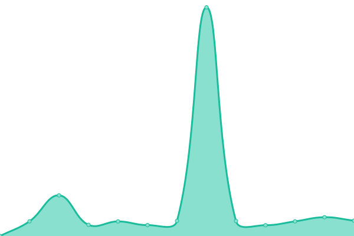

# [📈 Live Status](https://status.opentunnel.net): <!--live status--> **🟩 All systems operational**

This repository contains the open-source uptime monitor and status page for [roosterkid](https://status.opentunnel.net), powered by [Upptime](https://github.com/upptime/upptime).

With [Upptime](https://upptime.js.org), you can get your own unlimited and free uptime monitor and status page, powered entirely by a GitHub repository. We use [Issues](https://github.com/roosterkid/opentunnel-status-server/issues) as incident reports, [Actions](https://github.com/roosterkid/opentunnel-status-server/actions) as uptime monitors, and [Pages](https://status.opentunnel.net) for the status page.

<!--start: status pages-->
<!-- This summary is generated by Upptime (https://github.com/upptime/upptime) -->
<!-- Do not edit this manually, your changes will be overwritten -->
<!-- prettier-ignore -->
| URL | Status | History | Response Time | Uptime |
| --- | ------ | ------- | ------------- | ------ |
|  [OpenTunnel.net Website](https://opentunnel.net/) | 🟩 Up | [open-tunnel-net-website.yml](https://github.com/roosterkid/opentunnel-status-server/commits/HEAD/history/open-tunnel-net-website.yml) | 

 321ms
     
 | 

<a href="https://status.opentunnel.net/history/open-tunnel-net-website">100.00%</a>
    

|  [OpenTunnel.net Community](https://forum.opentunnel.net/) | 🟩 Up | [open-tunnel-net-community.yml](https://github.com/roosterkid/opentunnel-status-server/commits/HEAD/history/open-tunnel-net-community.yml) | 

 380ms
     
 | 

<a href="https://status.opentunnel.net/history/open-tunnel-net-community">100.00%</a>
    

|  [OpenTunnel.net VIP](https://vip.opentunnel.net/) | 🟩 Up | [open-tunnel-net-vip.yml](https://github.com/roosterkid/opentunnel-status-server/commits/HEAD/history/open-tunnel-net-vip.yml) | 

 290ms
     
 | 

<a href="https://status.opentunnel.net/history/open-tunnel-net-vip">100.00%</a>
    

|  [XRAY 🇸🇬 Singapore SGL 1](https://sgx-1.openv2ray.com/) | 🟩 Up | [xray-singapore-sgl-1.yml](https://github.com/roosterkid/opentunnel-status-server/commits/HEAD/history/xray-singapore-sgl-1.yml) | 

 706ms
     
 | 

<a href="https://status.opentunnel.net/history/xray-singapore-sgl-1">99.83%</a>
    

|  [XRAY 🇸🇬 Singapore SGO 1](https://sgx-2.openv2ray.com/) | 🟩 Up | [xray-singapore-sgo-1.yml](https://github.com/roosterkid/opentunnel-status-server/commits/HEAD/history/xray-singapore-sgo-1.yml) | 

 863ms
     
 | 

<a href="https://status.opentunnel.net/history/xray-singapore-sgo-1">100.00%</a>
    

|  [XRAY 🇺🇸 United States USO 1](https://usx-1.openv2ray.com/) | 🟩 Up | [xray-united-states-uso-1.yml](https://github.com/roosterkid/opentunnel-status-server/commits/HEAD/history/xray-united-states-uso-1.yml) | 

 201ms
     
 | 

<a href="https://status.opentunnel.net/history/xray-united-states-uso-1">100.00%</a>
    

|  [XRAY 游游 South Africa ZAP 1](https://zax-1.openv2ray.com/) | 🟩 Up | [xray-south-africa-zap-1.yml](https://github.com/roosterkid/opentunnel-status-server/commits/HEAD/history/xray-south-africa-zap-1.yml) | 

 775ms
     
 | 

<a href="https://status.opentunnel.net/history/xray-south-africa-zap-1">100.00%</a>
    

|  [XRAY 🇰🇷 South Korea KRP 1](https://krx-1.openv2ray.com/) | 🟩 Up | [xray-south-korea-krp-1.yml](https://github.com/roosterkid/opentunnel-status-server/commits/HEAD/history/xray-south-korea-krp-1.yml) | 

 621ms
     
 | 

<a href="https://status.opentunnel.net/history/xray-south-korea-krp-1">99.92%</a>
    

|  [XRAY 游游 Netherlands NLI 1](https://nlx-1.openv2ray.com/) | 🟩 Up | [xray-netherlands-nli-1.yml](https://github.com/roosterkid/opentunnel-status-server/commits/HEAD/history/xray-netherlands-nli-1.yml) | 

 305ms
     
 | 

<a href="https://status.opentunnel.net/history/xray-netherlands-nli-1">100.00%</a>
    

|  [XRAY 游쉻릖 Indonesia IDA 1](https://idx-1.openv2ray.com/) | 🟩 Up | [xray-indonesia-ida-1.yml](https://github.com/roosterkid/opentunnel-status-server/commits/HEAD/history/xray-indonesia-ida-1.yml) | 

 725ms
     
 | 

<a href="https://status.opentunnel.net/history/xray-indonesia-ida-1">100.00%</a>
    

|  [XRAY 游游 Japan JPP 1](https://jpx-1.openv2ray.com/) | 🟩 Up | [xray-japan-jpp-1.yml](https://github.com/roosterkid/opentunnel-status-server/commits/HEAD/history/xray-japan-jpp-1.yml) | 

 491ms
     
 | 

<a href="https://status.opentunnel.net/history/xray-japan-jpp-1">100.00%</a>
    

|  [XRAY 游游 Brazil BRP 1](https://brx-1.openv2ray.com/) | 🟩 Up | [xray-brazil-brp-1.yml](https://github.com/roosterkid/opentunnel-status-server/commits/HEAD/history/xray-brazil-brp-1.yml) | 

 385ms
     
 | 

<a href="https://status.opentunnel.net/history/xray-brazil-brp-1">100.00%</a>
    

|  [XRAY 游游 Russia RUL 1](https://rux-1.openv2ray.com/) | 🟩 Up | [xray-russia-rul-1.yml](https://github.com/roosterkid/opentunnel-status-server/commits/HEAD/history/xray-russia-rul-1.yml) | 

 554ms
     
 | 

<a href="https://status.opentunnel.net/history/xray-russia-rul-1">99.21%</a>
    

|  [XRAY 🇸🇬 Singapore SGD 1](https://sgx-3.openv2ray.com/) | 🟩 Up | [xray-singapore-sgd-1.yml](https://github.com/roosterkid/opentunnel-status-server/commits/HEAD/history/xray-singapore-sgd-1.yml) | 

 796ms
     
 | 

<a href="https://status.opentunnel.net/history/xray-singapore-sgd-1">100.00%</a>
    

|  [XRAY 游쉻릖 India IND 1](https://inx-1.openv2ray.com/) | 🟩 Up | [xray-india-ind-1.yml](https://github.com/roosterkid/opentunnel-status-server/commits/HEAD/history/xray-india-ind-1.yml) | 

 674ms
     
 | 

<a href="https://status.opentunnel.net/history/xray-india-ind-1">100.00%</a>
    

|  [XRAY 🇩🇪 Germany DEH 1](https://dex-1.openv2ray.com/) | 🟩 Up | [xray-germany-deh-1.yml](https://github.com/roosterkid/opentunnel-status-server/commits/HEAD/history/xray-germany-deh-1.yml) | 

 307ms
     
 | 

<a href="https://status.opentunnel.net/history/xray-germany-deh-1">100.00%</a>
    

|  [XRAY 🇨🇦 Canada CAO 1](https://cax-1.openv2ray.com/) | 🟩 Up | [xray-canada-cao-1.yml](https://github.com/roosterkid/opentunnel-status-server/commits/HEAD/history/xray-canada-cao-1.yml) | 

 80ms
     
 | 

<a href="https://status.opentunnel.net/history/xray-canada-cao-1">100.00%</a>
    

|  [V2RAY 🇸🇬 Singapore SGL 1](https://sgv-1.openv2ray.com/) | 🟩 Up | [v2-ray-singapore-sgl-1.yml](https://github.com/roosterkid/opentunnel-status-server/commits/HEAD/history/v2-ray-singapore-sgl-1.yml) | 

 710ms
     
 | 

<a href="https://status.opentunnel.net/history/v2-ray-singapore-sgl-1">99.70%</a>
    

|  [V2RAY 🇸🇬 Singapore SGP 1](https://sgv-2.openv2ray.com/) | 🟩 Up | [v2-ray-singapore-sgp-1.yml](https://github.com/roosterkid/opentunnel-status-server/commits/HEAD/history/v2-ray-singapore-sgp-1.yml) | 

 715ms
     
 | 

<a href="https://status.opentunnel.net/history/v2-ray-singapore-sgp-1">99.67%</a>
    

|  [V2RAY 游쉻릖 Indonesia IDA 1](https://idv-1.openv2ray.com/) | 🟩 Up | [v2-ray-indonesia-ida-1.yml](https://github.com/roosterkid/opentunnel-status-server/commits/HEAD/history/v2-ray-indonesia-ida-1.yml) | 

 711ms
     
 | 

<a href="https://status.opentunnel.net/history/v2-ray-indonesia-ida-1">100.00%</a>
    

|  [V2RAY 🇺🇸 United States USO 1](https://usv-1.openv2ray.com/) | 🟩 Up | [v2-ray-united-states-uso-1.yml](https://github.com/roosterkid/opentunnel-status-server/commits/HEAD/history/v2-ray-united-states-uso-1.yml) | 

 142ms
     
 | 

<a href="https://status.opentunnel.net/history/v2-ray-united-states-uso-1">99.78%</a>
    

|  [V2RAY 🇸🇬 Singapore SGM 1](https://sgv-3.openv2ray.com/) | 🟩 Up | [v2-ray-singapore-sgm-1.yml](https://github.com/roosterkid/opentunnel-status-server/commits/HEAD/history/v2-ray-singapore-sgm-1.yml) | 

 754ms
     
 | 

<a href="https://status.opentunnel.net/history/v2-ray-singapore-sgm-1">94.78%</a>
    

|  [V2RAY 🇸🇬 Singapore SGO 1](https://sgv-4.openv2ray.com/) | 🟩 Up | [v2-ray-singapore-sgo-1.yml](https://github.com/roosterkid/opentunnel-status-server/commits/HEAD/history/v2-ray-singapore-sgo-1.yml) | 

 1009ms
     
 | 

<a href="https://status.opentunnel.net/history/v2-ray-singapore-sgo-1">100.00%</a>
    

|  [V2RAY 游游 Vietnam VN 1](https://vnv-1.openv2ray.com/) | 🟩 Up | [v2-ray-vietnam-vn-1.yml](https://github.com/roosterkid/opentunnel-status-server/commits/HEAD/history/v2-ray-vietnam-vn-1.yml) | 

 830ms
     
 | 

<a href="https://status.opentunnel.net/history/v2-ray-vietnam-vn-1">99.34%</a>
    

|  [V2RAY 🇸🇬 Singapore SGV 1](https://sgv-5.openv2ray.com/) | 🟩 Up | [v2-ray-singapore-sgv-1.yml](https://github.com/roosterkid/opentunnel-status-server/commits/HEAD/history/v2-ray-singapore-sgv-1.yml) | 

 764ms
     
 | 

<a href="https://status.opentunnel.net/history/v2-ray-singapore-sgv-1">99.71%</a>
    

|  [V2RAY 游游 Russia RUL 1](https://ruv-1.openv2ray.com/) | 🟩 Up | [v2-ray-russia-rul-1.yml](https://github.com/roosterkid/opentunnel-status-server/commits/HEAD/history/v2-ray-russia-rul-1.yml) | 

 439ms
     
 | 

<a href="https://status.opentunnel.net/history/v2-ray-russia-rul-1">96.28%</a>
    

|  [V2RAY 游뷣릖 Australia AUL 1](https://auv-1.openv2ray.com/) | 🟩 Up | [v2-ray-australia-aul-1.yml](https://github.com/roosterkid/opentunnel-status-server/commits/HEAD/history/v2-ray-australia-aul-1.yml) | 

 641ms
     
 | 

<a href="https://status.opentunnel.net/history/v2-ray-australia-aul-1">100.00%</a>
    

|  [V2RAY 🇺🇸 United States USO 2](https://usv-2.openv2ray.com/) | 🟩 Up | [v2-ray-united-states-uso-2.yml](https://github.com/roosterkid/opentunnel-status-server/commits/HEAD/history/v2-ray-united-states-uso-2.yml) | 

 166ms
     
 | 

<a href="https://status.opentunnel.net/history/v2-ray-united-states-uso-2">99.70%</a>
    

|  [V2RAY 🇺🇸 United States USO 3](https://usv-3.openv2ray.com/) | 🟩 Up | [v2-ray-united-states-uso-3.yml](https://github.com/roosterkid/opentunnel-status-server/commits/HEAD/history/v2-ray-united-states-uso-3.yml) | 

 695ms
     
 | 

<a href="https://status.opentunnel.net/history/v2-ray-united-states-uso-3">99.75%</a>
    

|  [V2RAY 游쉻릖 Indonesia IDG 1](https://idv-2.openv2ray.com/) | 🟩 Up | [v2-ray-indonesia-idg-1.yml](https://github.com/roosterkid/opentunnel-status-server/commits/HEAD/history/v2-ray-indonesia-idg-1.yml) | 

 740ms
     
 | 

<a href="https://status.opentunnel.net/history/v2-ray-indonesia-idg-1">99.85%</a>
    

|  [V2RAY 🇸🇬 Singapore SGO 2](https://sgv-6.openv2ray.com/) | 🟩 Up | [v2-ray-singapore-sgo-2.yml](https://github.com/roosterkid/opentunnel-status-server/commits/HEAD/history/v2-ray-singapore-sgo-2.yml) | 

 703ms
     
 | 

<a href="https://status.opentunnel.net/history/v2-ray-singapore-sgo-2">100.00%</a>
    

|  [V2RAY 游游 South Africa ZAP 1](https://zav-1.openv2ray.com/) | 🟩 Up | [v2-ray-south-africa-zap-1.yml](https://github.com/roosterkid/opentunnel-status-server/commits/HEAD/history/v2-ray-south-africa-zap-1.yml) | 

 750ms
     
 | 

<a href="https://status.opentunnel.net/history/v2-ray-south-africa-zap-1">100.00%</a>
    

|  [V2RAY 游游 Netherlands NLB 6](https://nlv-6.openv2ray.com/) | 🟩 Up | [v2-ray-netherlands-nlb-6.yml](https://github.com/roosterkid/opentunnel-status-server/commits/HEAD/history/v2-ray-netherlands-nlb-6.yml) | 

 291ms
     
 | 

<a href="https://status.opentunnel.net/history/v2-ray-netherlands-nlb-6">100.00%</a>
    

|  [V2RAY 游游 Netherlands NLB 1](https://nlv-1.openv2ray.com/) | 🟩 Up | [v2-ray-netherlands-nlb-1.yml](https://github.com/roosterkid/opentunnel-status-server/commits/HEAD/history/v2-ray-netherlands-nlb-1.yml) | 

 290ms
     
 | 

<a href="https://status.opentunnel.net/history/v2-ray-netherlands-nlb-1">100.00%</a>
    

|  [V2RAY 🇩🇪 Germany DEH 1](https://dev-1.openv2ray.com/) | 🟩 Up | [v2-ray-germany-deh-1.yml](https://github.com/roosterkid/opentunnel-status-server/commits/HEAD/history/v2-ray-germany-deh-1.yml) | 

 308ms
     
 | 

<a href="https://status.opentunnel.net/history/v2-ray-germany-deh-1">100.00%</a>
    

|  [V2RAY 🇩🇪 Germany DEH 2](https://dev-2.openv2ray.com/) | 🟩 Up | [v2-ray-germany-deh-2.yml](https://github.com/roosterkid/opentunnel-status-server/commits/HEAD/history/v2-ray-germany-deh-2.yml) | 

 313ms
     
 | 

<a href="https://status.opentunnel.net/history/v2-ray-germany-deh-2">100.00%</a>
    

|  [V2RAY 🇭🇰 Hong Kong HKM 1](https://hkv-1.openv2ray.com/) | 🟩 Up | [v2-ray-hong-kong-hkm-1.yml](https://github.com/roosterkid/opentunnel-status-server/commits/HEAD/history/v2-ray-hong-kong-hkm-1.yml) | 

 691ms
     
 | 

<a href="https://status.opentunnel.net/history/v2-ray-hong-kong-hkm-1">96.88%</a>
    

|  [V2RAY 🇺🇸 United States USP 4](https://usv-4.openv2ray.com/) | 🟩 Up | [v2-ray-united-states-usp-4.yml](https://github.com/roosterkid/opentunnel-status-server/commits/HEAD/history/v2-ray-united-states-usp-4.yml) | 

 192ms
     
 | 

<a href="https://status.opentunnel.net/history/v2-ray-united-states-usp-4">91.45%</a>
    

|  [V2RAY 游쉻릖 Indonesia IDA 2](https://idv-3.openv2ray.com/) | 🟩 Up | [v2-ray-indonesia-ida-2.yml](https://github.com/roosterkid/opentunnel-status-server/commits/HEAD/history/v2-ray-indonesia-ida-2.yml) | 

 711ms
     
 | 

<a href="https://status.opentunnel.net/history/v2-ray-indonesia-ida-2">100.00%</a>
    

|  [V2RAY 游游 South Africa ZAP 2](https://zav-2.openv2ray.com/) | 🟩 Up | [v2-ray-south-africa-zap-2.yml](https://github.com/roosterkid/opentunnel-status-server/commits/HEAD/history/v2-ray-south-africa-zap-2.yml) | 

 753ms
     
 | 

<a href="https://status.opentunnel.net/history/v2-ray-south-africa-zap-2">100.00%</a>
    

|  [TROJAN 🇸🇬 Singapore SGV 1](https://sgt-1.opensvr.net/) | 🟩 Up | [trojan-singapore-sgv-1.yml](https://github.com/roosterkid/opentunnel-status-server/commits/HEAD/history/trojan-singapore-sgv-1.yml) | 

 803ms
     
 | 

<a href="https://status.opentunnel.net/history/trojan-singapore-sgv-1">99.04%</a>
    

|  [TROJAN 🇸🇬 Singapore SGP 1](https://sgt-2.opensvr.net/) | 🟩 Up | [trojan-singapore-sgp-1.yml](https://github.com/roosterkid/opentunnel-status-server/commits/HEAD/history/trojan-singapore-sgp-1.yml) | 

 1143ms
     
 | 

<a href="https://status.opentunnel.net/history/trojan-singapore-sgp-1">99.69%</a>
    

|  [TROJAN 🇩🇪 Germany DEH 1](https://det-1.opensvr.net/) | 🟩 Up | [trojan-germany-deh-1.yml](https://github.com/roosterkid/opentunnel-status-server/commits/HEAD/history/trojan-germany-deh-1.yml) | 

 326ms
     
 | 

<a href="https://status.opentunnel.net/history/trojan-germany-deh-1">100.00%</a>
    

|  [TROJAN 游游 Netherlands NLB 1](https://nlt-1.opensvr.net/) | 🟩 Up | [trojan-netherlands-nlb-1.yml](https://github.com/roosterkid/opentunnel-status-server/commits/HEAD/history/trojan-netherlands-nlb-1.yml) | 

 308ms
     
 | 

<a href="https://status.opentunnel.net/history/trojan-netherlands-nlb-1">100.00%</a>
    

|  [TROJAN 游游 Japan JPP 1](https://jpt-1.opensvr.net/) | 🟩 Up | [trojan-japan-jpp-1.yml](https://github.com/roosterkid/opentunnel-status-server/commits/HEAD/history/trojan-japan-jpp-1.yml) | 

 501ms
     
 | 

<a href="https://status.opentunnel.net/history/trojan-japan-jpp-1">99.37%</a>
    

|  [TROJAN 🇺🇸 United States USO 1](https://ust-1.opensvr.net/) | 🟩 Up | [trojan-united-states-uso-1.yml](https://github.com/roosterkid/opentunnel-status-server/commits/HEAD/history/trojan-united-states-uso-1.yml) | 

 365ms
     
 | 

<a href="https://status.opentunnel.net/history/trojan-united-states-uso-1">98.10%</a>
    

|  [TROJAN 🇸🇬 Singapore SGA 1](https://sgt-3.opensvr.net/) | 🟩 Up | [trojan-singapore-sga-1.yml](https://github.com/roosterkid/opentunnel-status-server/commits/HEAD/history/trojan-singapore-sga-1.yml) | 

 795ms
     
 | 

<a href="https://status.opentunnel.net/history/trojan-singapore-sga-1">99.72%</a>
    

|  [TROJAN 游쉻릖 Indonesia IDB 1](https://idt-1.opensvr.net/) | 🟩 Up | [trojan-indonesia-idb-1.yml](https://github.com/roosterkid/opentunnel-status-server/commits/HEAD/history/trojan-indonesia-idb-1.yml) | 

 734ms
     
 | 

<a href="https://status.opentunnel.net/history/trojan-indonesia-idb-1">100.00%</a>
    

|  [SSH 🇸🇬 Singapore SGP 1](http://sg-1.opentunnel.net/) | 🟩 Up | [ssh-singapore-sgp-1.yml](https://github.com/roosterkid/opentunnel-status-server/commits/HEAD/history/ssh-singapore-sgp-1.yml) | 

 496ms
     
 | 

<a href="https://status.opentunnel.net/history/ssh-singapore-sgp-1">100.00%</a>
    

|  [SSH 🇺🇸 United States USF 1](http://us-1.opentunnel.net/) | 🟩 Up | [ssh-united-states-usf-1.yml](https://github.com/roosterkid/opentunnel-status-server/commits/HEAD/history/ssh-united-states-usf-1.yml) | 

 164ms
     
 | 

<a href="https://status.opentunnel.net/history/ssh-united-states-usf-1">91.10%</a>
    

|  [SSH 🇸🇬 Singapore SGS 1](http://sggs-1.opentunnel.net/) | 🟩 Up | [ssh-singapore-sgs-1.yml](https://github.com/roosterkid/opentunnel-status-server/commits/HEAD/history/ssh-singapore-sgs-1.yml) | 

 498ms
     
 | 

<a href="https://status.opentunnel.net/history/ssh-singapore-sgs-1">99.75%</a>
    

|  [SSH 🇩🇪 Germany DEH 1](http://de-1.opentunnel.net/) | 🟩 Up | [ssh-germany-deh-1.yml](https://github.com/roosterkid/opentunnel-status-server/commits/HEAD/history/ssh-germany-deh-1.yml) | 

 221ms
     
 | 

<a href="https://status.opentunnel.net/history/ssh-germany-deh-1">99.28%</a>
    

|  [SSH 🇸🇬 Singapore SGP 2](http://sg-2.opentunnel.net/) | 🟩 Up | [ssh-singapore-sgp-2.yml](https://github.com/roosterkid/opentunnel-status-server/commits/HEAD/history/ssh-singapore-sgp-2.yml) | 

 492ms
     
 | 

<a href="https://status.opentunnel.net/history/ssh-singapore-sgp-2">100.00%</a>
    

|  [SSH 游쉻릖 Indonesia IDB 1](http://id-1.opentunnel.net/) | 🟩 Up | [ssh-indonesia-idb-1.yml](https://github.com/roosterkid/opentunnel-status-server/commits/HEAD/history/ssh-indonesia-idb-1.yml) | 

 749ms
     
 | 

<a href="https://status.opentunnel.net/history/ssh-indonesia-idb-1">100.00%</a>
    

|  [SSH 🇸🇬 Singapore SGL 1](http://sg-3.opentunnel.net/) | 🟩 Up | [ssh-singapore-sgl-1.yml](https://github.com/roosterkid/opentunnel-status-server/commits/HEAD/history/ssh-singapore-sgl-1.yml) | 

 466ms
     
 | 

<a href="https://status.opentunnel.net/history/ssh-singapore-sgl-1">100.00%</a>
    

|  [SSH 游游 France FRO 1](http://fr-1.opentunnel.net/) | 🟩 Up | [ssh-france-fro-1.yml](https://github.com/roosterkid/opentunnel-status-server/commits/HEAD/history/ssh-france-fro-1.yml) | 

 202ms
     
 | 

<a href="https://status.opentunnel.net/history/ssh-france-fro-1">99.74%</a>
    

|  [OVPN 🇸🇬 Singapore SGP 1](http://sgo-1.opensvr.net:8080/) | 🟩 Up | [ovpn-singapore-sgp-1.yml](https://github.com/roosterkid/opentunnel-status-server/commits/HEAD/history/ovpn-singapore-sgp-1.yml) | 

 485ms
     
 | 

<a href="https://status.opentunnel.net/history/ovpn-singapore-sgp-1">100.00%</a>
    

|  [OVPN 🇺🇸 United States USF 1](http://uso-1.opensvr.net:8080/) | 🟩 Up | [ovpn-united-states-usf-1.yml](https://github.com/roosterkid/opentunnel-status-server/commits/HEAD/history/ovpn-united-states-usf-1.yml) | 

 141ms
     
 | 

<a href="https://status.opentunnel.net/history/ovpn-united-states-usf-1">100.00%</a>
    

|  [OVPN 🇸🇬 Singapore SGS 1](http://sgo-2.opensvr.net:8080/) | 🟩 Up | [ovpn-singapore-sgs-1.yml](https://github.com/roosterkid/opentunnel-status-server/commits/HEAD/history/ovpn-singapore-sgs-1.yml) | 

 481ms
     
 | 

<a href="https://status.opentunnel.net/history/ovpn-singapore-sgs-1">100.00%</a>
    

|  [OVPN 🇩🇪 Germany DEH 1](http://deo-1.opensvr.net:8080/) | 🟩 Up | [ovpn-germany-deh-1.yml](https://github.com/roosterkid/opentunnel-status-server/commits/HEAD/history/ovpn-germany-deh-1.yml) | 

 211ms
     
 | 

<a href="https://status.opentunnel.net/history/ovpn-germany-deh-1">100.00%</a>
    

|  [OVPN 游뷣릖 Australia AUP 1](http://auo-1.opensvr.net:8080/) | 🟩 Up | [ovpn-australia-aup-1.yml](https://github.com/roosterkid/opentunnel-status-server/commits/HEAD/history/ovpn-australia-aup-1.yml) | 

 436ms
     
 | 

<a href="https://status.opentunnel.net/history/ovpn-australia-aup-1">100.00%</a>
    

|  [OVPN 游游 France FRO 1](http://fro-1.opensvr.net:8080/) | 🟩 Up | [ovpn-france-fro-1.yml](https://github.com/roosterkid/opentunnel-status-server/commits/HEAD/history/ovpn-france-fro-1.yml) | 

 209ms
     
 | 

<a href="https://status.opentunnel.net/history/ovpn-france-fro-1">100.00%</a>
    

|  [OVPN 游뷣릖 United Arab Emirates AEM 1](http://aeo-1.opensvr.net:8080/) | 🟩 Up | [ovpn-united-arab-emirates-aem-1.yml](https://github.com/roosterkid/opentunnel-status-server/commits/HEAD/history/ovpn-united-arab-emirates-aem-1.yml) | 

 399ms
     
 | 

<a href="https://status.opentunnel.net/history/ovpn-united-arab-emirates-aem-1">100.00%</a>
    

|  [OVPN 🇸🇬 Singapore SGD 1](http://sgo-3.opensvr.net:8080/) | 🟩 Up | [ovpn-singapore-sgd-1.yml](https://github.com/roosterkid/opentunnel-status-server/commits/HEAD/history/ovpn-singapore-sgd-1.yml) | 

 504ms
     
 | 

<a href="https://status.opentunnel.net/history/ovpn-singapore-sgd-1">100.00%</a>
    

|  [OVPN 游쉻릖 Indonesia IDB 1](http://ido-1.opensvr.net:8080/) | 🟩 Up | [ovpn-indonesia-idb-1.yml](https://github.com/roosterkid/opentunnel-status-server/commits/HEAD/history/ovpn-indonesia-idb-1.yml) | 

 728ms
     
 | 

<a href="https://status.opentunnel.net/history/ovpn-indonesia-idb-1">100.00%</a>
    

<!--end: status pages-->

[**Visit our status website →**](https://status.opentunnel.net)

## 📄 License

- Powered by: [Upptime](https://github.com/upptime/upptime)
- Code: [MIT](./LICENSE) © [roosterkid](https://status.opentunnel.net)
- Data in the `./history` directory: [Open Database License](https://opendatacommons.org/licenses/odbl/1-0/)
